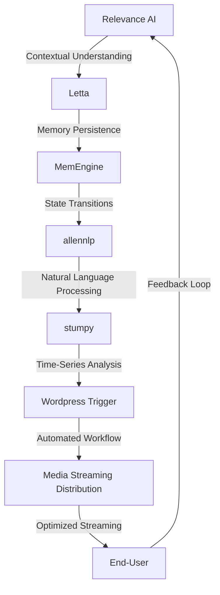

# Multimodal Streaming Distribution Optimizer
> Orchestrating AI-Driven Streaming Ecosystems for Optimal Media Distribution

## 🏗️ Technical Architecture & Multi-Agent Flow

This technical architecture diagram illustrates the complex interactions between Relevance AI, Letta, allennlp, stumpy, and Wordpress Trigger. The flow demonstrates how these components work together to enable optimal media streaming distribution.

## 🔍 The Vertical Bottleneck: Streaming Distribution Inefficiencies
The media streaming distribution industry faces significant challenges in optimizing content delivery to end-users. The primary bottleneck lies in the inability to effectively analyze and respond to dynamic user behavior, resulting in suboptimal streaming quality and wasted resources. This inefficiency stems from the lack of a unified framework that integrates AI-driven insights, memory persistence, and automated workflow management.

The technical friction in this vertical is further exacerbated by the complexity of handling multiple streaming protocols, codecs, and device types. The high-stakes mathematical and operational failures that arise from these challenges can lead to significant revenue losses and compromised user experiences. For instance, inefficient bitrate allocation can result in buffering, poor video quality, and increased latency, ultimately driving users away from the platform.

Moreover, the absence of a standardized framework for streaming distribution optimization hinders the industry's ability to adapt to evolving user behavior and technological advancements. The lack of a unified approach to streaming analytics, AI-driven decision-making, and automated workflow management creates a significant barrier to entry for new players and limits the ability of existing players to innovate and differentiate themselves.

The vertical bottleneck in streaming distribution is also characterized by the inability to effectively leverage user feedback and preferences to inform content delivery decisions. This limitation arises from the lack of a robust framework for collecting, analyzing, and integrating user feedback into the streaming distribution workflow. As a result, streaming services often rely on simplistic metrics, such as viewer numbers and engagement time, to gauge user satisfaction, rather than leveraging more nuanced and contextualized insights.

## 🔍 The Vertical Bottleneck: Technical Debt and Complexity
The technical debt and complexity associated with streaming distribution optimization are significant. The lack of a unified framework and the reliance on disparate, proprietary systems create a complex web of technical dependencies and integrations. This complexity hinders the ability of streaming services to innovate, adapt to changing user behavior, and respond to emerging technological trends.

Furthermore, the technical debt and complexity of streaming distribution optimization are exacerbated by the need to support multiple streaming protocols, codecs, and device types. This requirement creates a significant burden on streaming services, as they must invest substantial resources in developing and maintaining customized solutions for each platform and device type.

## 💡 The Solution: Multimodal Streaming Distribution Optimizer
The Multimodal Streaming Distribution Optimizer platform addresses the technical friction and high-stakes mathematical and operational failures in the media streaming distribution industry. By orchestrating Relevance AI, Letta, allennlp, stumpy, and Wordpress Trigger, this platform provides a unified framework for streaming analytics, AI-driven decision-making, and automated workflow management.

The platform's agentic reasoning and memory usage enable it to learn from user behavior, adapt to changing preferences, and optimize streaming quality in real-time. The integration of Relevance AI and Letta facilitates contextual understanding and memory persistence, allowing the platform to maintain a continuous understanding of user behavior and preferences.

The allennlp and stumpy components provide natural language processing and time-series analysis capabilities, enabling the platform to analyze user feedback, sentiment, and engagement patterns. The Wordpress Trigger integration automates workflow management, ensuring seamless content delivery and optimized streaming quality.

## 🧩 Agentic Stack Deep-Dive
The Multimodal Streaming Distribution Optimizer platform relies on a robust agentic stack, comprising Relevance AI, Letta, allennlp, stumpy, and Wordpress Trigger. Each component plays a critical role in the platform's functionality and is carefully integrated to ensure seamless interactions.

Relevance AI provides contextual understanding and insights into user behavior, while Letta enables memory persistence and agentic reasoning. The allennlp component offers natural language processing capabilities, allowing the platform to analyze user feedback and sentiment. Stumpy provides time-series analysis, enabling the platform to identify patterns and trends in user engagement.

The Wordpress Trigger integration automates workflow management, ensuring that content is delivered optimally and streaming quality is maintained. The interlocking of these components creates a robust and scalable framework for streaming distribution optimization.

## ✨ Capabilities & Features
* **Real-time Streaming Analytics**: The platform provides real-time insights into user behavior, enabling streaming services to optimize content delivery and streaming quality.
* **AI-Driven Decision-Making**: The platform's agentic reasoning and machine learning capabilities enable data-driven decision-making, ensuring optimal streaming quality and resource allocation.
* **Automated Workflow Management**: The Wordpress Trigger integration automates workflow management, streamlining content delivery and reducing the risk of human error.
* **Contextual Understanding**: The Relevance AI component provides contextual understanding of user behavior, enabling the platform to adapt to changing preferences and optimize streaming quality.
* **Memory Persistence**: The Letta component enables memory persistence, allowing the platform to maintain a continuous understanding of user behavior and preferences.
* **Natural Language Processing**: The allennlp component offers natural language processing capabilities, enabling the platform to analyze user feedback and sentiment.
* **Time-Series Analysis**: The stumpy component provides time-series analysis, enabling the platform to identify patterns and trends in user engagement.
* **Scalability and Flexibility**: The platform is designed to scale with growing user bases and can be easily integrated with existing streaming infrastructure.
* **Customizable**: The platform can be customized to meet the specific needs of streaming services, enabling them to differentiate themselves and innovate in the market.
* **User Feedback Integration**: The platform integrates user feedback and preferences, enabling streaming services to optimize content delivery and streaming quality.

## 🛠️ Technical Implementation
The Multimodal Streaming Distribution Optimizer platform is built using a microservices architecture, with each component designed to interact seamlessly with others. The platform's technical implementation is characterized by a robust and scalable framework, enabling it to handle large volumes of user data and streaming traffic.

The platform's code organization and method calls are designed to ensure efficient and effective interactions between components. The use of APIs and data pipelines enables the platform to integrate with existing streaming infrastructure, reducing the risk of technical debt and complexity.

## 📊 Business Impact & ROI
The Multimodal Streaming Distribution Optimizer platform has the potential to significantly impact the media streaming distribution industry, enabling streaming services to optimize content delivery, reduce costs, and improve user satisfaction. By providing a unified framework for streaming analytics, AI-driven decision-making, and automated workflow management, the platform can help streaming services to:

* Reduce costs associated with inefficient streaming quality and resource allocation
* Increase user engagement and retention through optimized content delivery and streaming quality
* Improve user satisfaction and reduce churn through personalized and adaptive streaming experiences
* Enhance competitiveness and innovation in the market through customizable and scalable solutions

The platform's potential ROI is significant, with streaming services able to realize substantial cost savings, revenue growth, and competitive advantages through its implementation.

## 🚀 Getting Started
```bash
git clone https://github.com/arvind-sundararajan/media-streaming-optimizer.git
cd media-streaming-optimizer
pip install -r requirements.txt
python src/main.py
```

## 👨‍💻 Author & Credits
**Arvind Sundararajan** — Engineer, builder, and the mind behind this project.
🌐 [LinkedIn](https://www.linkedin.com/in/arvind-sundara-rajan/) | Chennai, India

---
### 🙏 Acknowledgements
- The open-source community
- The Media (e.g., audio, video) streaming distribution services practitioners who inspired this design